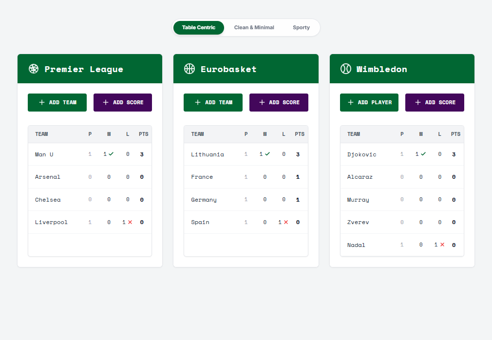
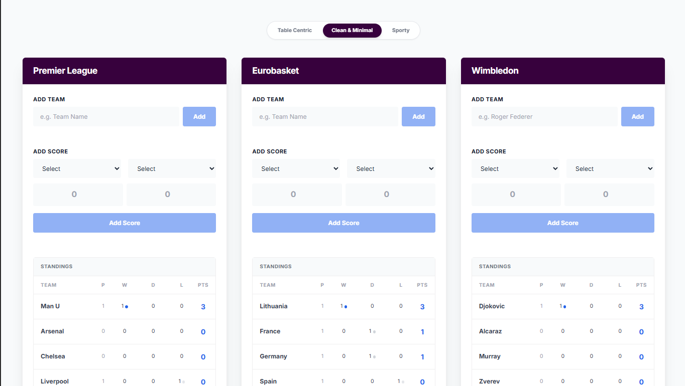
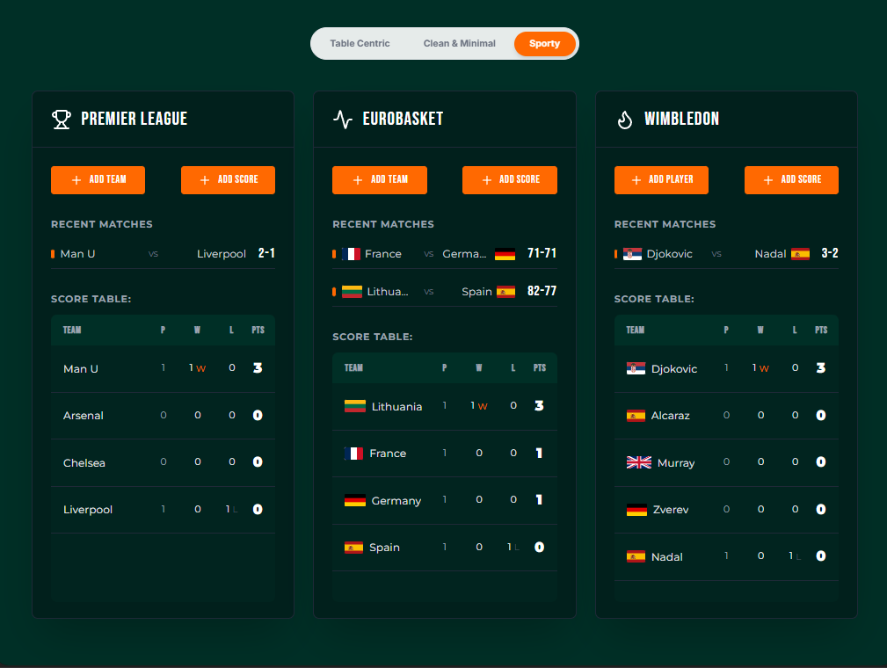

# Sports Standings Manager

A robust Single Page Application (SPA) built to manage sports tournaments across different leagues. This application allows users to manage teams, record match results, and view real-time calculated standings with data persistence.

Built with **Next.js**, **React**, **Redux Toolkit**, **TypeScript**, and **Tailwind CSS v4**.

## 🚀 Features

- **Multi-League Support**: Manage Premier League (Football), Eurobasket (Basketball), and Wimbledon (Tennis) simultaneously.
- **Dynamic Standings**: Tables auto-update and sort based on Points > Goal Difference > Goals For.
- **Data Persistence**: All data is saved to `localStorage`, ensuring data remains available after page refreshes.
- **Scoring System**:
  - **Win**: 3 Points
  - **Draw**: 1 Point
  - **Loss**: 0 Points
- **Validation**: Prevents duplicate matches and ensures teams cannot play against themselves.
- **Responsive Design**: Fully responsive layouts optimized for desktop and mobile.

## 🎨 Design Themes

The application features three distinct design themes that can be switched instantly via the sticky top navigation bar.

### 1. Table-Centric Design

_Layout: 2 Columns | Style: Cool Neutrals & Monospace_
Focused on data density and clarity. Uses a monospace font (`Space Mono`) and explicit icons for wins/losses. ideal for analysts.



### 2. Clean & Minimal Design

_Layout: 3 Columns | Style: Modern & Airy_
A modern interface using `Inter` font, soft shadows, and a clean blue/white palette. The layout separates actions (Add Team/Score) from the data view.



### 3. Sporty & Energetic Design

_Layout: 3 Columns | Style: Bold & High Contrast_
An immersive dark-mode style theme using `Montserrat` and `Bebas Neue`. Features country flags, a high-contrast scoreboard, and a dedicated recent matches feed.



---

## 🛠️ Tech Stack

- **Framework**: Next.js 16
- **State Management**: Redux Toolkit
- **Styling**: Tailwind CSS v4 (using `@theme` variables)
- **Language**: TypeScript
- **Icons**: Lucide React
- **Flags**: FlagCDN

## 📦 Setup & Installation

1. **Clone the repository**

   ```bash
   git clone https://github.com/777Rob/sports-betting-app
   cd sports-betting-app
   cd app
   ```

2. **Install dependencies**

   ```bash
   npm install
   ```

3. **Run the development server**

   ```bash
   npm run dev
   ```

4. **Open your browser**
   Navigate to [http://localhost:3000](http://localhost:3000)

## ✅ Requirements Checklist

This project fulfills the technical challenge requirements:

- [x] **Functionality**: Users can add teams and scores; standings update automatically.
- [x] **Logic**: Win (3pts), Draw (1pt), Loss (0pts).
- [x] **Sorting**: Teams are sorted by Points desc.
- [x] **Persistence**: Data survives browser refresh (Redux + LocalStorage).
- [x] **Architecture**: SPA principles using React + Redux.
- [x] **Design**: implemented all 3 requested variations (Clean, Sporty, Table-Centric).
- [x] **Bonus**: Written in TypeScript with modular component structure.

## 🧪 Running Tests

Unit tests for Redux logic and Standings calculations are included.

```bash
npm test
```
